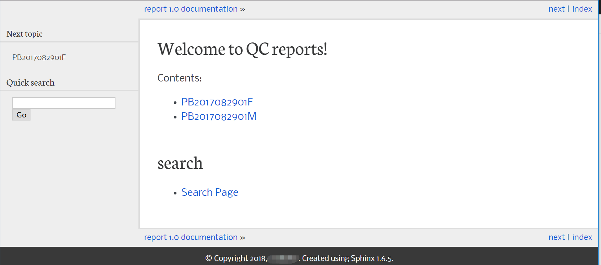
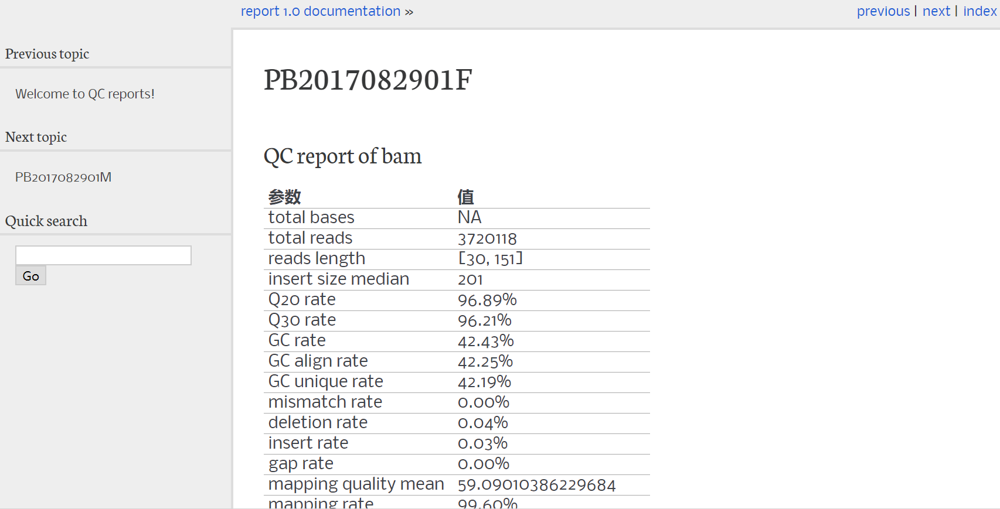

# qc_report

## usage
```sh
#python3 sample_rst.py -h
usage: sample_rst.py [-h] [-r RAWDIR] [-o OUTDIR] [-t TEMPLATE]
                     [-p REPORT_DIR]

optional arguments:
  -h, --help            show this help message and exit
  -r RAWDIR, --rawdir RAWDIR
                        samples' directory
  -o OUTDIR, --outdir OUTDIR
                        template directory, default .
  -t TEMPLATE, --template TEMPLATE
                        raw template file or git file,default is /kk/report_v1.tar.gz
  -p REPORT_DIR, --report_dir REPORT_DIR
                        report directory,default is current report

```

## example
```sh
python3 ../sample_rst.py -r ..
```

## example/report




